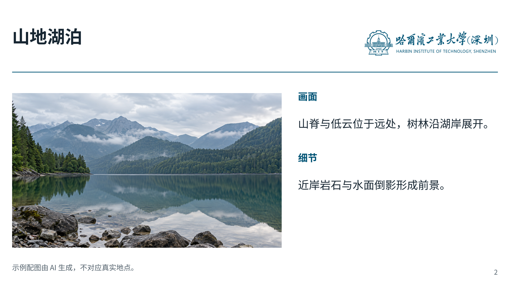

# HITsz Touying Slides

一套用于学术汇报的**非官方** Typst/Touying 幻灯片模板。它采用 16:9 白底、哈工大蓝 `#005375`、统一标题线和小页码，适合开题、组会与毕业答辩。模板代码可公开复用；默认示例使用文字校名，也可传入本地校徽或字标。

## 页面预览

封面：通用示例传入校区字标后的效果。


内容页：与实际课题无关的山地湖泊图文示例，展示图片、简短说明和右上角字标的排版。风景图由 AI 生成，不对应真实地点。



预览图展示了可选的校徽字标用法。仓库不提供独立的校徽或字标素材；直接编译 `example.typ` 得到的是文字校名版本，内容页使用同一张示例风景图。

## 快速开始

环境：Typst 0.15.x、Touying 0.7.4、`Noto Sans CJK SC` 字体。本模板已用 Typst 0.15.1 编译验证。

```sh
typst compile --root . example.typ example.pdf
```

复制 `theme.typ` 与 `example.typ` 后，先修改 `example.typ` 的题目、姓名、正文和备注。PDF 可直接放映；若需要 PPTX，可再用熟悉的转换工具从 PDF 制作放映备用件。示例的备注通过 Touying 的 `speaker-note` 编写。

## 页面接口

导入主题并应用全局样式：

```typst
#import "theme.typ": *
#show: hitsz-theme
```

| 函数 | 用途 | 常用参数 |
|---|---|---|
| `cover-slide` | 封面 | `kind`、`school`、`author`、`program`、`advisor`、`date`、`logo` |
| `content-slide` | 常规内容页 | `school`、`logo`、`title-size`、`source` |
| `figure-slide` | 图片和技术图为主的页面 | `school`、`logo`、`title-size` |
| `kicker`、`subdued`、`emphasis` | 少量层级强调 | 文本内容 |

`logo` 接受 Typst 内容，不是固定文件名。例如，使用者在有权使用校区字标的前提下，可在自己的演示稿中写：

```typst
#let cover-mark = image("assets/local/wordmark-white.png", width: 260pt)
#let page-mark = image("assets/local/wordmark-blue.png", width: 220pt)

#cover-slide([研究题目], logo: cover-mark, author: [姓名])
#content-slide([研究问题], logo: page-mark)[正文内容]
```

不传 `logo` 时，页面使用可编辑的校名文字，示例可以直接编译。较长的标题会在为右上角标识预留的区域内换行；也可用 `title-size: 25pt` 调整。

## 公开使用说明

这份模板由个人制作，与哈尔滨工业大学或深圳校区没有官方关联。校色参考[哈尔滨工业大学视觉识别系统手册](https://zri.hit.edu.cn/_upload/article/files/98/51/0533957a4593ace7556731065e61/375a362f-fbc3-4fc2-ba9e-2a62ab40d890.pdf)。代码按 [MIT 许可证](LICENSE)提供；预览图中出现的学校名称、校徽和字标不属于这份代码许可证。仓库不分发独立的校徽或字标文件。

发布建议和后续提交 Typst Universe 前需要核对的事项见 [PUBLISHING.md](PUBLISHING.md)。
